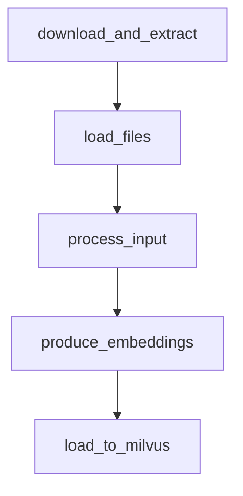

# Airflow Pipeline Documentation

This directory contains Airflow DAGs for orchestrating Milvus document processing pipelines.

## Pipeline Architecture

### Shared Functions Approach
All business logic is centralized in `../pipeline_functions.py` to follow DRY principles:

```
pipeline_functions.py          # Shared business logic
├── download_and_extract()     # Download and extract Milvus docs
├── load_files()              # Load markdown files and split into chunks  
├── process_input()           # Filter and clean text chunks
├── produce_embeddings()      # Generate embeddings with Ollama
└── load_to_milvus()         # Insert embeddings into Milvus collection
```

### Execution Options

**1. Standalone Pipeline** (`../standalone_pipeline.py`)
- Direct execution without Airflow dependencies
- Fast development and testing
- Simple debugging

**2. Airflow DAG** (`dags/milvus_pipeline.py`)
- Orchestrated execution with task dependencies
- Built-in retry logic and monitoring
- Production-ready workflow

## DAG Files

### `milvus_pipeline.py` ✅ Recommended
- **Description**: DRY implementation using shared functions
- **DAG ID**: `milvus_docs_pipeline`
- **Tasks**: 5 tasks with clear dependencies
- **Benefits**: Maintainable, testable, consistent with standalone version

## VS Code Debugging

### Debug Configuration Guide

**For Airflow DAGs** (`dags/*.py`):
```
1. Use Docker for DAG execution: docker-compose up -d
2. For debugging DAG logic, debug shared functions in pipeline_functions.py
3. Press F5 → Select "Debug Current File" on pipeline_functions.py
4. No local Airflow installation needed
```

**For Standalone Pipeline** (`../standalone_pipeline.py`):
```
1. Open standalone_pipeline.py
2. Set breakpoints in main() or imported functions
3. Press F5 → Select "Debug Current File"  
4. No Airflow dependencies needed
```

**For Shared Functions** (`../pipeline_functions.py`):
```
1. Open pipeline_functions.py
2. Set breakpoints in any function
3. Press F5 → Select "Debug Current File"
4. Functions run independently for testing
```

### Debug Task Selection Matrix

| File Type | VS Code Debug Task | Environment Setup | Use Case |
|-----------|-------------------|-------------------|----------|
| `dags/*.py` | **"Debug Airflow DAG"** | Airflow DB + PYTHONPATH | DAG development |
| `../standalone_pipeline.py` | **"Debug Current File"** | None | Quick testing |
| `../pipeline_functions.py` | **"Debug Current File"** | None | Function testing |

## Usage Examples

### Development Workflow
```bash
# 1. Test individual functions
uv run python -c "from pipeline_functions import download_and_extract; download_and_extract()"

# 2. Test complete standalone pipeline  
uv run python standalone_pipeline.py

# 3. Test Airflow DAG via Docker
docker-compose up -d
# Then access http://localhost:8080 and trigger DAG
```

### Docker Deployment
```bash
# Start complete stack (Airflow + Milvus)
docker-compose up -d

# Access Airflow UI: http://localhost:8080 (admin/admin)
# Access Milvus UI: http://localhost:9091
# Trigger DAG: milvus_docs_pipeline_dry
```

## Pipeline Flow



**Task Details:**
1. **download_and_extract**: Downloads Milvus docs zip, extracts to temp directory
2. **load_files**: Reads markdown files, splits by "# " headers into chunks
3. **process_input**: Filters chunks (min 10 chars), removes empty content
4. **produce_embeddings**: Generates embeddings using Ollama model
5. **load_to_milvus**: Creates collection, inserts embeddings into local Milvus

## Environment Variables

| Variable | Description | Default |
|----------|-------------|---------|
| `OLLAMA_EMBEDDING_MODEL` | Ollama model for embeddings | `nomic-embed-text:v1.5` |
| `OLLAMA_COLLECTION_NAME` | Milvus collection name | `milvus_ollama_collection` |
| `AIRFLOW_HOME` | Airflow configuration directory | `./airflow` |

## Prerequisites

**Docker Setup (Recommended):**
```bash
# Start all services (Milvus + Airflow)
docker-compose up -d

# Access Airflow UI: http://localhost:8080 (admin/admin)
# Access Milvus UI: http://localhost:9091
```

**Local Development:**
- Ollama with embedding model installed
- Python dependencies via `uv sync` (excludes Airflow)
- Use standalone pipeline for development

## Troubleshooting

**Common Issues:**

1. **SQLite Database Error**
   - Use standalone version: `uv run python milvus_pipeline_debugs.py`
   - No Airflow dependencies required

2. **Import Errors**
   - Ensure you're in project root directory
   - Use `uv run python` to activate environment

3. **Milvus Connection Failed**
   - Start Milvus: `docker run -d --name milvus -p 19530:19530 milvusdb/milvus:latest`
   - Verify connection: `curl http://localhost:19530/health`

4. **Ollama Model Missing**
   - Install model: `ollama pull nomic-embed-text:v1.5`
   - Verify: `ollama list`

## Best Practices

**Development:**
- Use standalone pipeline for rapid iteration
- Debug shared functions independently
- Test with small data samples first

**Production:**
- Use Airflow DAG for scheduling and monitoring
- Set appropriate retry policies
- Monitor task execution via Airflow UI

**Maintenance:**
- Update logic only in `pipeline_functions.py`
- Both execution methods automatically inherit changes
- Test both approaches after modifications